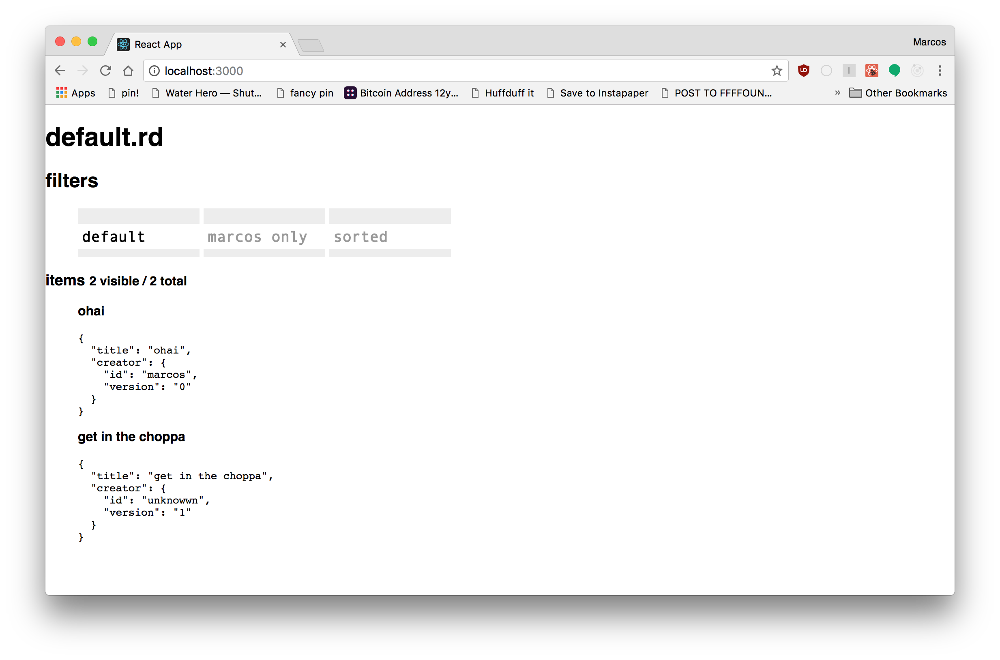

# Filterdoc

a sketch of an app that lets you define custom filters on arbitrary lists

this is a bad idea, but only because it defines a pseudo-filetype that embeds js that is eval'd against data stored in the file itself. in a safer version, this uses a node vm or something similar in a web context (or probably uses javascriptcore in a js context for the document itself)



**running**

```
yarn
yarn start
```